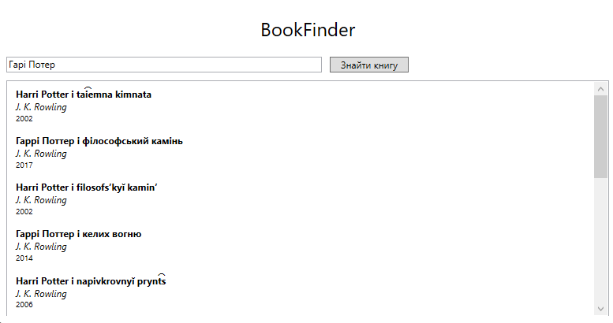

# BookFinder

BookFinder is a lightweight WPF MVVM app that lets users search for books by topic. It demonstrates API integration in a simple but structured MVVM-based application.

## Features

- Search for books by entering a topic
- Fetches book data from an external API
- Displays a list with basic information (title, author, etc.)
- Designed for demonstration of MVVM + API usage

## Technologies

- WPF (.NET 6+)
- MVVM
- REST API (e.g. OpenLibrary or Google Books)

## Purpose

This project is a small demonstration of:

- Using APIs in WPF
- Separating logic with MVVM
- Building lightweight desktop apps

## Screenshots

Here is an example screenshot of the application:

